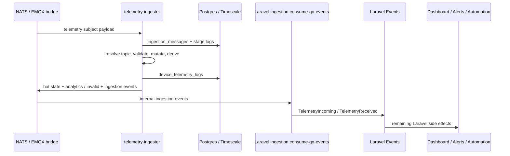

# Data Ingestion Module - Overview

## What This Module Does

Telemetry ingestion is split between the Go hot path and Laravel control-plane behavior.

The Go ingester consumes inbound NATS/MQTT telemetry and performs:

1. Deduplication.
2. Binding-topic expansion.
3. Profile channel resolution.
4. Payload validation.
5. Mutation and derived-value calculation.
6. Persistence into ingestion audit and telemetry tables.
7. Data-plane side effects: hot-state writes, analytics publishes, invalid telemetry publishes.
8. Internal event publication for remaining Laravel side effects.

Laravel owns profile/device configuration, admin UI, throttled realtime dashboard broadcasts, threshold alerts, and automation fan-out.

## Core Concepts

| Concept | Description |
| --- | --- |
| Go Ingester | `services/telemetry-ingester`, NATS subscriber persistence pipeline |
| Ingestion Message | Durable audit record in `ingestion_messages` |
| Stage Log | Per-stage diagnostics in `ingestion_stage_logs` |
| Telemetry Log | Final telemetry record in `device_telemetry_logs` |
| Binding Resolver | Go port of `DeviceSignalBindingResolver` behavior for migration/source topics |
| Profile Channel Resolver | Go port of active MQTT publish-channel registry |
| Laravel Bridge | `ingestion:consume-go-events`, consumes internal Go events and dispatches Laravel events |

## End-to-End Pipeline

## Runtime Driver

`INGESTION_PIPELINE_DRIVER=go` is the default. The legacy long-running Laravel `iot:ingest-telemetry` command has been removed; telemetry ingestion is handled by the Go ingester.

The default Docker stack runs:

- `iot-ingest-telemetry`: Go telemetry ingester.
- `ingestion-go-events`: Laravel bridge for realtime dashboards, alerts, and automation.
- `horizon`: Laravel queue workers for remaining product side effects.

## Key Source Areas

- Go ingester: `services/telemetry-ingester/`
- Laravel bridge: `app/Console/Commands/Ingestion/ConsumeTelemetryIngestionEvents.php`
- Config: `config/ingestion.php`
- Tests: `tests/Feature/DataIngestion/`

## Realtime Broadcast Controls

Persisted telemetry still emits the internal `TelemetryReceived` event for Laravel side effects, but dashboard realtime updates are handled by `BroadcastTelemetryRealtimeUpdate`.

The listener checks `ingestion.pipeline.broadcast_realtime` and applies `ingestion.pipeline.broadcast_throttle_seconds` per device/channel before dispatching `TelemetryRealtimeUpdated`. This prevents every telemetry row from creating a broadcast job during high-volume bursts while preserving alerts and automation processing.

Set `INGESTION_PIPELINE_BROADCAST_THROTTLE_SECONDS=0` to broadcast every telemetry log. Production should keep a non-zero value; `5` seconds is the default.

## Go Data-Plane Side Effects

The Go ingester now owns telemetry data-plane side effects after persistence:

- hot-state latest-value writes into the NATS KV `device-states` bucket.
- processed telemetry analytics publishes.
- invalid telemetry publishes.

Laravel no longer queues hot-state or analytics listener jobs for every persisted telemetry row.

## Documentation Map

- [02 - Architecture](02-architecture.md)
- [03 - Operations](03-operations.md)
