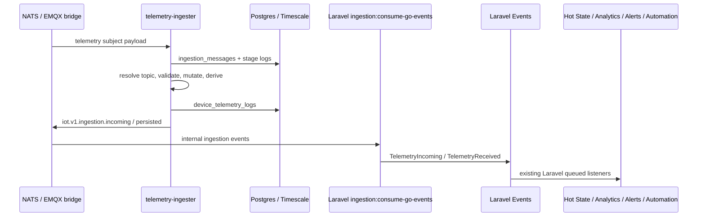

# Data Ingestion Module - Overview

## What This Module Does

Telemetry ingestion is split between a Go hot path and Laravel application side effects.

The Go ingester consumes inbound NATS/MQTT telemetry and performs:

1. Deduplication.
2. Binding-topic expansion.
3. Profile channel resolution.
4. Payload validation.
5. Mutation and derived-value calculation.
6. Persistence to ingestion audit and telemetry tables.
7. Internal event publication for Laravel side effects.

Laravel remains the control plane and side-effect layer. It owns profile/device configuration, admin UI, throttled realtime broadcasts, hot-state writes, analytics publishing, threshold alerts, and automation fan-out.

## Core Concepts

| Concept | Description |
| --- | --- |
| Go Ingester | `services/telemetry-ingester`, the NATS subscriber and persistence pipeline |
| Ingestion Message | Durable audit record in `ingestion_messages` |
| Stage Log | Per-stage diagnostics in `ingestion_stage_logs` |
| Telemetry Log | Final telemetry record in `device_telemetry_logs` |
| Binding Resolver | Go port of `DeviceSignalBindingResolver` behavior for migration/source topics |
| Profile Channel Resolver | Go port of the active MQTT publish-channel registry |
| Laravel Bridge | `ingestion:consume-go-events`, consumes internal Go events and dispatches Laravel events |

## End-to-End Pipeline

## Runtime Driver

`INGESTION_PIPELINE_DRIVER=go` is the default. The PHP pipeline is still present as a rollback path with `INGESTION_PIPELINE_DRIVER=laravel` and the legacy `iot:ingest-telemetry` command.

The default Docker stack runs:

- `iot-ingest-telemetry`: Go telemetry ingester.
- `ingestion-go-events`: Laravel bridge for side effects.
- `horizon`: Laravel queue workers for downstream side effects.

## Key Source Areas

- Go ingester: `services/telemetry-ingester/`
- Laravel bridge: `app/Console/Commands/Ingestion/ConsumeTelemetryIngestionEvents.php`
- PHP rollback pipeline: `app/Domain/DataIngestion/`
- Config: `config/ingestion.php`
- Tests: `tests/Feature/DataIngestion/`

## Realtime Broadcast Controls

Persisted telemetry still emits the internal `TelemetryReceived` event for Laravel side effects, but dashboard realtime updates are handled by `BroadcastTelemetryRealtimeUpdate`.

The listener checks `ingestion.pipeline.broadcast_realtime` and then applies `ingestion.pipeline.broadcast_throttle_seconds` per device/channel before dispatching `TelemetryRealtimeUpdated`. This prevents every telemetry row from creating a broadcast job during high-volume bursts while preserving current hot-state, analytics, alerts, and automation processing.

Set `INGESTION_PIPELINE_BROADCAST_THROTTLE_SECONDS=0` to broadcast every telemetry log. Production should keep a non-zero value, with `5` seconds as the default.

## Hot-State Write Controls

Hot-state writes are still performed by `QueueTelemetryHotStateWrites`, but the listener now coalesces queued writes per device/channel before writing to the NATS KV latest-value store.

The listener records the latest telemetry log id for the device/channel and queues one delayed write for the coalescing window. When the job runs, it writes the latest row observed in that window instead of every intermediate telemetry row. This reduces Horizon worker pressure during bursts while keeping the hot state current to the latest value.

Set `INGESTION_PIPELINE_HOT_STATE_COALESCE_SECONDS=0` to restore per-row hot-state writes. The default is `1` second.

## Documentation Map

- [02 - Architecture](02-architecture.md)
