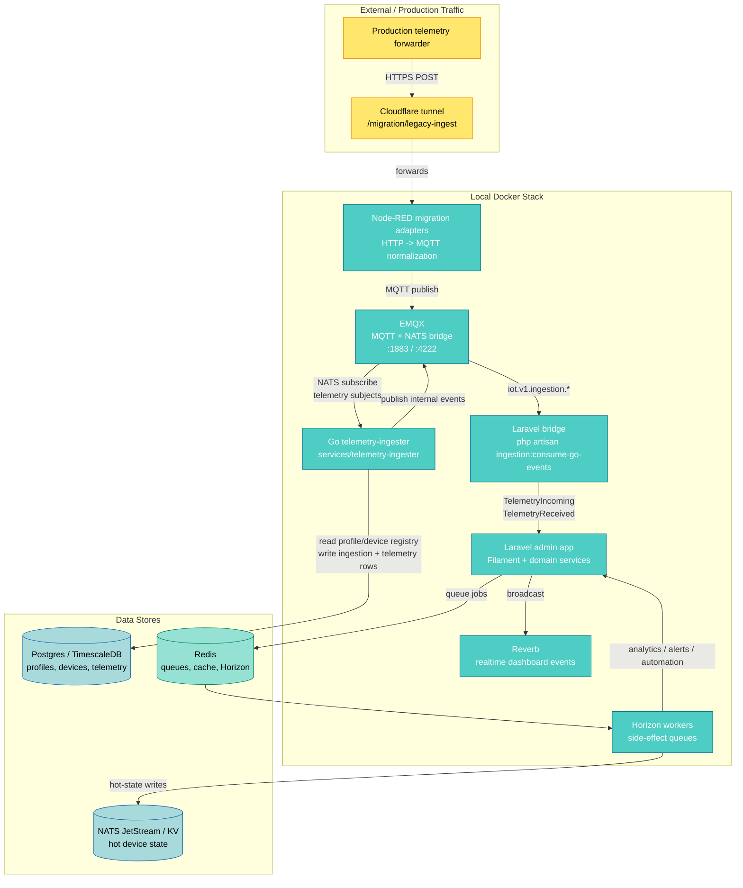
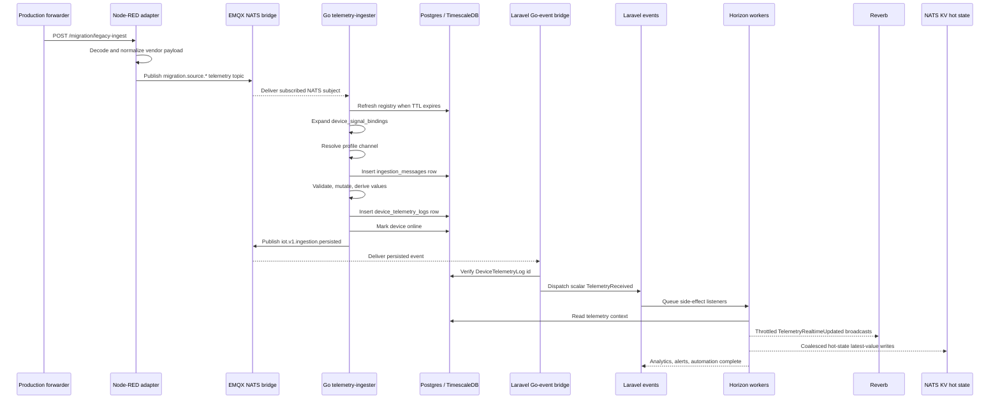
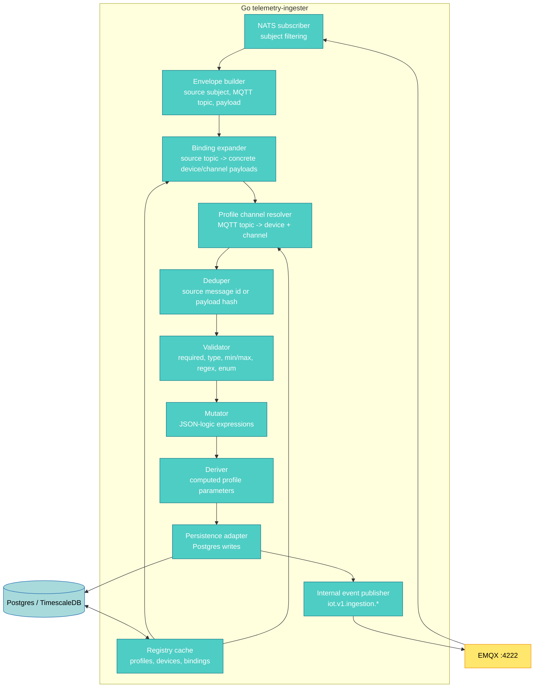
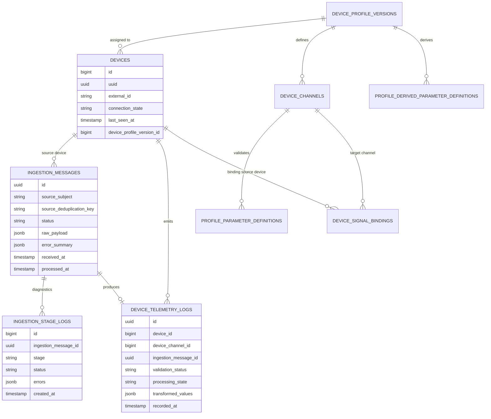
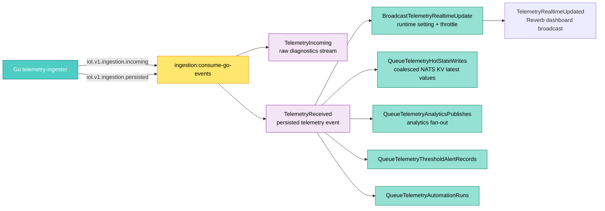
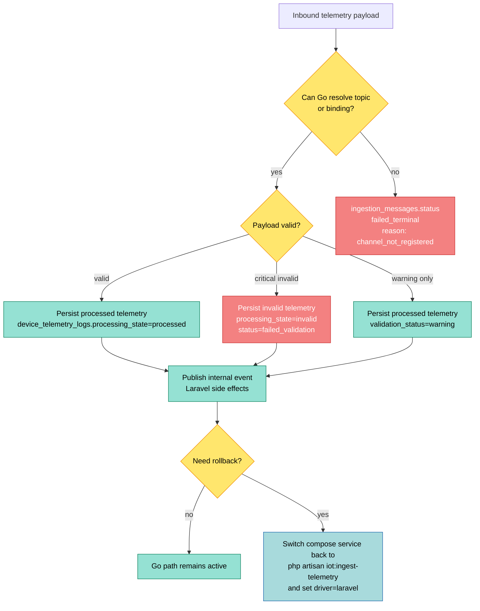

# Data Ingestion Module - Architecture

## Runtime Model

The telemetry hot path now runs in Go. Laravel remains the control plane and side-effect layer.

## Runtime Sequence

This is the normal successful path for production-forwarded telemetry.

## Go Ingester Components

The Go service owns only the ingestion hot path. It does not own admin UI, automation rules, alert rules, or dashboard rendering.

## Database Contract

Go writes the same ingestion and telemetry tables the Laravel pipeline wrote. Laravel still reads these tables for admin screens, dashboards, reports, alerts, and automation.

## Side-Effect Boundary

The bridge keeps downstream Laravel behavior intact while removing Laravel queue work from the ingestion hot path.

## Failure And Rollback Paths

## Operational Notes

- Local compose builds `services/telemetry-ingester/Dockerfile`.
- Production compose expects `TELEMETRY_INGESTER_IMAGE`.
- The Go ingester subscribes to EMQX on port `4222`, not the standalone NATS container, because Node-RED publishes telemetry into EMQX/MQTT.
- `failed_terminal` with `channel_not_registered` usually means the incoming source topic has no active `device_signal_bindings` row.
- Rollback is the PHP path: set the driver to `laravel` and run the legacy `php artisan iot:ingest-telemetry` service instead of the Go container.
