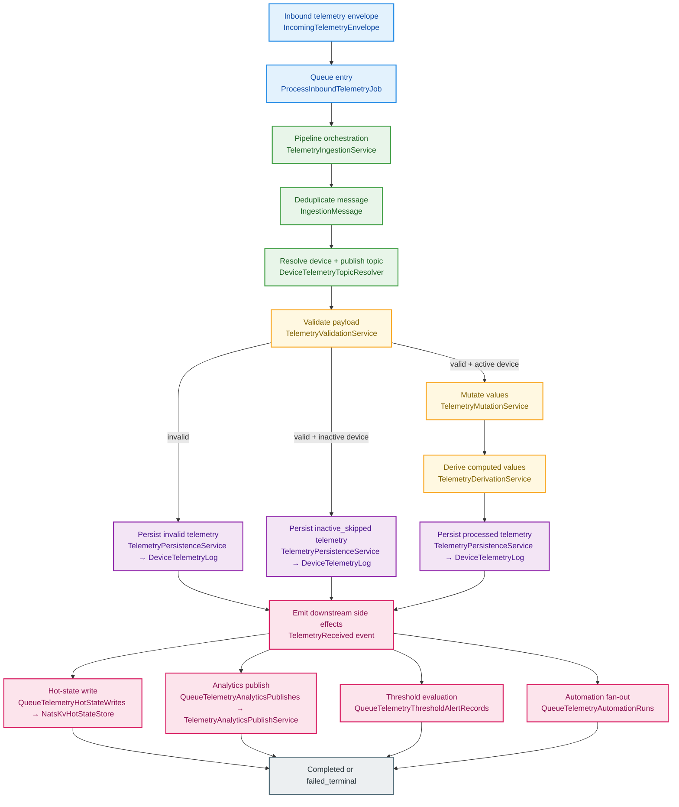
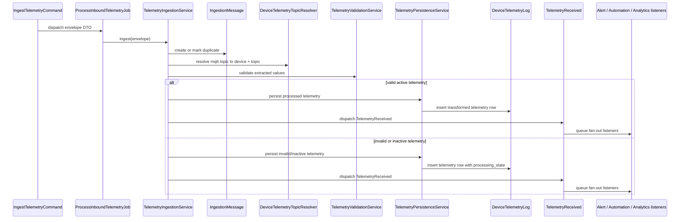
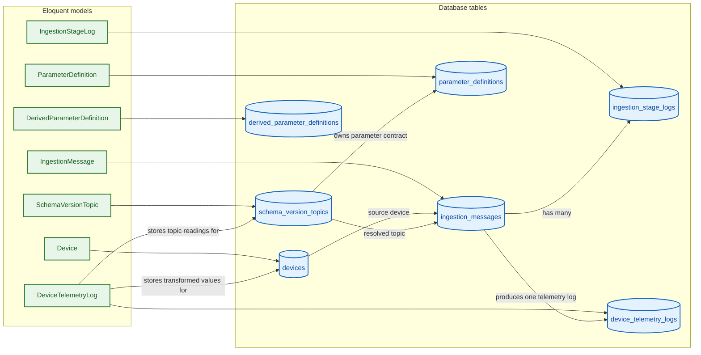
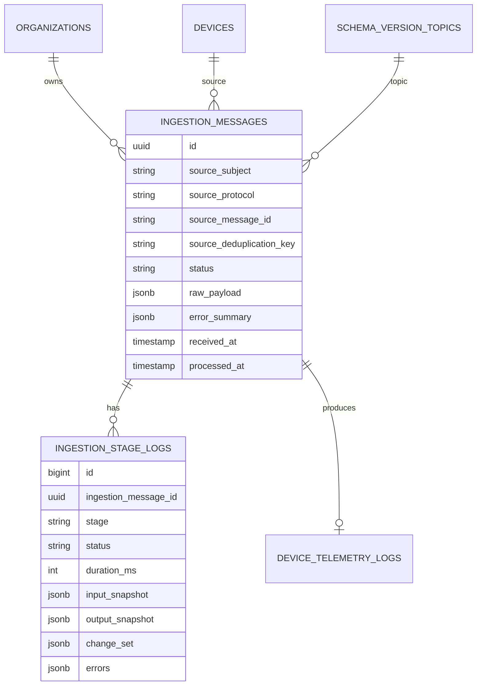

# Data Ingestion Module - Architecture

## Architectural Model

The ingestion pipeline is a staged orchestrator with explicit stage logging.

## Runtime Collaboration View

This view is useful during a walkthrough because it shows the exact handoff between command, job, orchestrator, storage, and downstream listeners.

## Component Responsibilities

| Component                          | Responsibility                                                                |
| ---------------------------------- | ----------------------------------------------------------------------------- |
| `IngestTelemetryCommand`           | NATS subscriber; filters subjects; dispatches queue job                       |
| `ProcessInboundTelemetryJob`       | Queue entry point that reconstructs envelope DTO                              |
| `TelemetryIngestionService`        | Full orchestration and stage transitions                                      |
| `DeviceTelemetryTopicResolver`     | Topic registry with TTL refresh                                               |
| `TelemetryValidationService`       | Parameter extraction + validation error classification                        |
| `TelemetryMutationService`         | Field mutation pass                                                           |
| `TelemetryDerivationService`       | Derived metric evaluation with dependency order                               |
| `TelemetryPersistenceService`      | Writes `DeviceTelemetryLog`, marks presence online, emits `TelemetryReceived` |
| `NatsKvHotStateStore`              | Writes processed values into NATS KV hot-state bucket                         |
| `TelemetryAnalyticsPublishService` | Conditional analytics publish based on feature/config                         |

## Database Structure and Models

The ingestion module centers around one durable pipeline record and one final telemetry record:

- `App\Domain\DataIngestion\Models\IngestionMessage` → `ingestion_messages`
- `App\Domain\DataIngestion\Models\IngestionStageLog` → `ingestion_stage_logs`
- `App\Domain\Telemetry\Models\DeviceTelemetryLog` → `device_telemetry_logs`

Supporting lookups come from:

- `App\Domain\DeviceManagement\Models\Device`
- `App\Domain\DeviceSchema\Models\SchemaVersionTopic`
- `App\Domain\DeviceSchema\Models\ParameterDefinition`
- `App\Domain\DeviceSchema\Models\DerivedParameterDefinition`

### Key persisted structures

| Model / Table                                  | Why it matters in the walkthrough                                   | Key fields to mention                                                                                                       |
| ---------------------------------------------- | ------------------------------------------------------------------- | --------------------------------------------------------------------------------------------------------------------------- |
| `IngestionMessage` / `ingestion_messages`      | Durable audit record for each inbound payload                       | `source_subject`, `source_message_id`, `source_deduplication_key`, `status`, `error_summary`, `received_at`, `processed_at` |
| `IngestionStageLog` / `ingestion_stage_logs`   | Per-stage diagnostics for replay and troubleshooting                | `stage`, `status`, `duration_ms`, `input_snapshot`, `output_snapshot`, `change_set`, `errors`                               |
| `DeviceTelemetryLog` / `device_telemetry_logs` | Final time-series record used by dashboards and downstream features | `raw_payload`, `transformed_values`, `validation_errors`, `processing_state`, `recorded_at`                                 |
| `SchemaVersionTopic`                           | Defines the publish topic contract resolved from MQTT subject       | `device_schema_version_id`, `suffix`, `direction`                                                                           |
| `ParameterDefinition`                          | Defines extraction and validation rules for a topic payload         | `json_path`, `type`, `required`, `is_critical`, `mutation_expression`                                                       |
| `DerivedParameterDefinition`                   | Defines calculated metrics derived from validated values            | `key`, `expression`, `dependencies`                                                                                         |

## Domain and Service Boundaries

| Layer             | Main classes                                                                                                                                                   | Responsibility                                                         |
| ----------------- | -------------------------------------------------------------------------------------------------------------------------------------------------------------- | ---------------------------------------------------------------------- |
| Transport / entry | `IncomingTelemetryEnvelope`, `IngestTelemetryCommand`, `ProcessInboundTelemetryJob`                                                                            | Receives NATS/MQTT traffic and turns it into a typed ingestion request |
| Orchestration     | `TelemetryIngestionService`                                                                                                                                    | Owns the pipeline order, status transitions, and stage logging         |
| Schema resolution | `DeviceTelemetryTopicResolver`, `TelemetrySchemaMetadataCache`                                                                                                 | Resolves which device/topic/schema contract applies to a payload       |
| Value processing  | `TelemetryValidationService`, `TelemetryMutationService`, `TelemetryDerivationService`                                                                         | Extracts, validates, transforms, and derives telemetry fields          |
| Persistence       | `TelemetryPersistenceService`, `IngestionMessage`, `IngestionStageLog`, `DeviceTelemetryLog`                                                                   | Writes pipeline and telemetry records to the database                  |
| Side effects      | `TelemetryReceived`, `QueueTelemetryHotStateWrites`, `QueueTelemetryAnalyticsPublishes`, `QueueTelemetryThresholdAlertRecords`, `QueueTelemetryAutomationRuns` | Fans telemetry out to realtime, analytics, alerts, and automation      |

## Stage-to-Class Map

| Pipeline stage   | Main classes to point at                                                               |
| ---------------- | -------------------------------------------------------------------------------------- |
| Ingress          | `IncomingTelemetryEnvelope`, `ProcessInboundTelemetryJob`, `TelemetryIngestionService` |
| Deduplication    | `TelemetryIngestionService`, `IngestionMessage`                                        |
| Topic resolution | `DeviceTelemetryTopicResolver`, `SchemaVersionTopic`, `Device`                         |
| Validation       | `TelemetryValidationService`, `ParameterDefinition`                                    |
| Mutation         | `TelemetryMutationService`, `ParameterDefinition`                                      |
| Derivation       | `TelemetryDerivationService`, `DerivedParameterDefinition`                             |
| Persistence      | `TelemetryPersistenceService`, `DeviceTelemetryLog`, `IngestionStageLog`               |
| Fan-out          | `TelemetryReceived`, alert/automation/analytics listeners                              |

## Data Model Notes

When presenting this diagram live, it helps to summarize it as:

- `ingestion_messages` answers: “What happened to this payload?”
- `ingestion_stage_logs` answers: “Where in the pipeline did it fail or slow down?”
- `device_telemetry_logs` answers: “What telemetry did the business features finally consume?”

## Status and Stage Semantics

### `IngestionStatus`

- `queued`
- `processing`
- `completed`
- `failed_validation`
- `inactive_skipped`
- `failed_terminal`
- `duplicate`

### `IngestionStage`

- `ingress`
- `validate`
- `mutate`
- `derive`
- `persist`
- `publish`

## Deduplication Strategy

`IncomingTelemetryEnvelope::deduplicationKey()`:

- prefers source message id when present,
- otherwise hashes subject + payload + received timestamp.

The dedup key is unique in `ingestion_messages`. Existing rows become `duplicate` status.

## Publish Stage Failure Handling

Hot-state and analytics publish are isolated in try/catch blocks.

If either fails:

- telemetry log `processing_state` is set to `publish_failed`,
- publish stage log is written with errors,
- ingestion message becomes `failed_terminal`.

This preserves persisted telemetry while exposing post-persist failure visibility.

## Configuration Surface

`config/ingestion.php` controls:

- feature defaults (`enabled`, `driver`, `publish_analytics`),
- queue connection and queue name,
- resolver registry TTL,
- stage snapshot capture,
- NATS host/port/subject and analytics prefixes.

## Operational Notes

- Listener ignores internal NATS subjects (`$JS.`, `$KV.`, `_INBOX.`, `_REQS.`) and analytics/invalid subjects to avoid loops.
- Redis queue with `phpredis` requires extension availability; command warns when missing.
- Stage logs are suitable for post-incident replay analysis and performance profiling.
