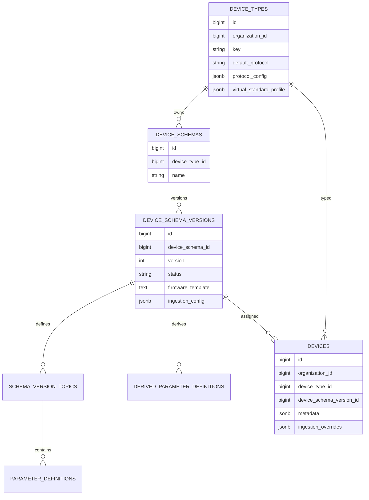
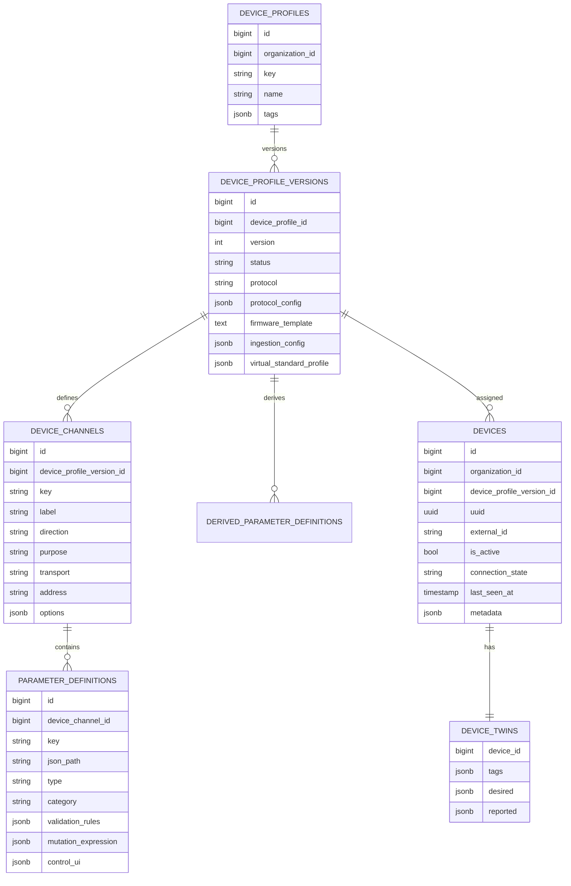

# Device Profile Redesign Proposal

## Verdict

Flattening `DeviceSchema` and `DeviceSchemaVersion` into one model is worth doing. It removes a parent table that currently adds little runtime value, while preserving the part of the design that is working well: parameters are grouped by event boundary.

The stronger recommendation is to go one step further and make a device point to exactly one active contract version. Today a `Device` stores both `device_type_id` and `device_schema_version_id`, even though the schema version already belongs to a type through `DeviceSchema`. That makes the model harder to reason about and allows inconsistent assignments unless every form and service remembers to guard it.

## Current Shape



## Problems With The Current Hierarchy

| Problem | Impact |
|---------|--------|
| `DeviceSchema` is mostly a grouping table | It creates another relationship layer without adding much behavior. |
| `Device` stores both type and schema version | A device can theoretically reference a type and a schema version from another type. |
| Protocol config lives on `DeviceType` | Versioned changes to protocol, endpoints, base topics, or firmware templates are split across models. |
| Topic terminology leaks into every protocol | MQTT fits naturally; HTTP devices are forced into topic-shaped thinking. |
| Parameter IDs become cross-domain dependencies | Dashboards, alerts, automations, and reports couple to definition rows instead of stable event/parameter keys. |

## Proposed Shape

Use a flatter profile-version contract while keeping the event boundary and parameter segregation.



## Main Design Decisions

### 1. Collapse schema and version

Replace:

- `device_schemas`
- `device_schema_versions`

With:

- `device_profile_versions`

Each version has its own name/version/status/protocol/config/firmware/ingestion metadata. The parent `device_profiles` table keeps catalog identity and global-vs-organization scoping.

If we want the smallest possible change, we can keep the existing name `DeviceSchemaVersion` and add `device_type_id`, `name`, and protocol fields directly to it. That is simpler than today, but `DeviceProfileVersion` is a better domain name because it describes the full runtime contract, not just telemetry schema.

### 2. Replace topic with channel

Keep the same boundary that topics currently provide, but rename the concept to `DeviceChannel`.

For MQTT:

- `transport = mqtt`
- `address = telemetry`, `state`, `command`, or `ack`
- resolved address remains `{base_topic}/{device_identifier}/{address}`

For HTTP:

- `transport = http`
- `address = /telemetry`, `/state`, `/commands/{command}`
- direction and purpose still define whether the channel is inbound telemetry, state, command, event, or ack

This keeps parameters segregated by event boundary without making HTTP devices look like MQTT devices.

### 3. Assign devices to one contract version

`devices.device_profile_version_id` becomes the single contract assignment. Runtime code loads the profile version and then gets:

- protocol config,
- channels,
- parameters,
- derived parameters,
- firmware template,
- virtual standard profile.

This removes the need for every form and service to cross-check `device_type_id` against `device_schema_version_id`.

### 4. Add twin-style mutable device state

Keep the stable contract in profile versions, but move mutable per-device facts into a twin-like row:

- `tags`: service-owned searchable metadata such as plant, line, capability, customer labels.
- `desired`: platform intent such as requested reporting interval or target command state.
- `reported`: device-observed state such as firmware, connectivity, capabilities, and last known configuration.

This borrows the useful part of Azure IoT Hub's device twin model without making the twin responsible for telemetry history. Azure twins are JSON documents with tags, desired properties, and reported properties; Azure also treats telemetry messages as the better audit/history channel when intermediate states matter.

## Why This Is Better

| Area | Existing hierarchy | Proposed design |
|------|--------------------|-----------------|
| Contract assignment | Device points to type and schema version | Device points to one profile version |
| Versioning | Protocol config on type, firmware/schema on version | Full runtime contract versioned together |
| Event boundaries | MQTT topic-specific naming | Protocol-neutral channels |
| HTTP support | Awkward because topics are not native to HTTP | HTTP endpoints are channels with parameters |
| UI authoring | Device Type -> Schema -> Version -> Topics -> Parameters | Profile -> Version -> Channels -> Parameters |
| Runtime loading | Multiple relationships and consistency assumptions | One profile version load path |
| Mutable metadata | `devices.metadata` and overrides are secondary | Twin state is first-class |
| Cross-domain references | Many features reference topic/parameter row IDs | Prefer stable channel keys and parameter keys |

## HTTP Devices

The current topic model helps MQTT because MQTT's natural event boundary is the topic. It helps less for HTTP because the event boundary is usually one of:

- endpoint path,
- request method,
- webhook route,
- payload envelope type,
- command resource.

`DeviceChannel` handles both protocols:

| Device behavior | MQTT channel | HTTP channel |
|-----------------|--------------|--------------|
| Telemetry upload | `devices/{id}/telemetry` | `POST /devices/{id}/telemetry` |
| State report | `devices/{id}/state` | `POST /devices/{id}/state` or `PATCH /reported` |
| Command dispatch | `devices/{id}/command` | `POST /devices/{id}/commands` |
| Ack feedback | `devices/{id}/ack` | `POST /devices/{id}/acks` |

Parameters remain scoped to the channel, so validation, mutation, UI controls, and derivations still have a clear boundary.

## Migration Sketch

1. Create `device_profiles` from existing `device_types`.
2. Create `device_profile_versions` by joining `device_types`, `device_schemas`, and `device_schema_versions`.
3. Rename `schema_version_topics` conceptually to `device_channels`; keep existing rows but migrate `suffix` to `address` and add `transport`.
4. Move `protocol_config`, `default_protocol`, `firmware_template`, `ingestion_config`, and `virtual_standard_profile` onto profile versions.
5. Update `devices` to reference only `device_profile_version_id`.
6. Add `device_twins` or equivalent JSON columns for `tags`, `desired`, and `reported`.
7. Update dashboards, alerts, reports, automations, signal bindings, and command logs to prefer `channel_key` and `parameter_key` for configuration, while retaining IDs only as runtime optimization if needed.

## Implementation Notes

- Keep `ParameterDefinition` as a relational model. It has real behavior: extraction, validation, mutation, default values, control UI inference, and command payload placement.
- Keep `DerivedParameterDefinition` as relational unless expressions become heavily profile-local JSON. Its dependency validation and cycle detection are useful.
- Keep `DeviceChannel` relational. Channels are authored and linked independently, and command feedback links are easier to model relationally.
- Avoid making the entire profile definition one JSON blob for v1. JSON-only contracts are flexible but harder to author, validate, diff, and reference from Filament.
- Use JSONB for mutable device twin data and generated/transformed telemetry values, not for every contract definition.

## Acceptance Criteria

- A device can be created by selecting exactly one profile version.
- MQTT and HTTP devices both expose channels with scoped parameters.
- Ingestion resolves a device and channel without loading a separate device type and schema chain.
- Command UI can build payloads from command-channel parameters.
- Telemetry validation, mutation, derivation, and persistence still produce the current `transformed_values` shape.
- Dashboards, reports, alerts, and automations can target stable `channel_key` and `parameter_key` values.

## Recommendation

Do not only flatten `DeviceSchema` into `DeviceSchemaVersion` and stop there. That would help, but it leaves the biggest awkwardness: devices still bind to both a type and a schema version, and protocol configuration remains outside the versioned contract.

Adopt the profile-version model:

```text
DeviceProfile -> DeviceProfileVersion -> DeviceChannel -> ParameterDefinition
Device -> DeviceProfileVersion
Device -> DeviceTwin
```

This keeps the useful boundaries from the current design, makes HTTP devices first-class, and moves mutable device state closer to the Azure-style model without losing the platform-specific validation, mutation, derivation, dashboard, and control features already built here.
