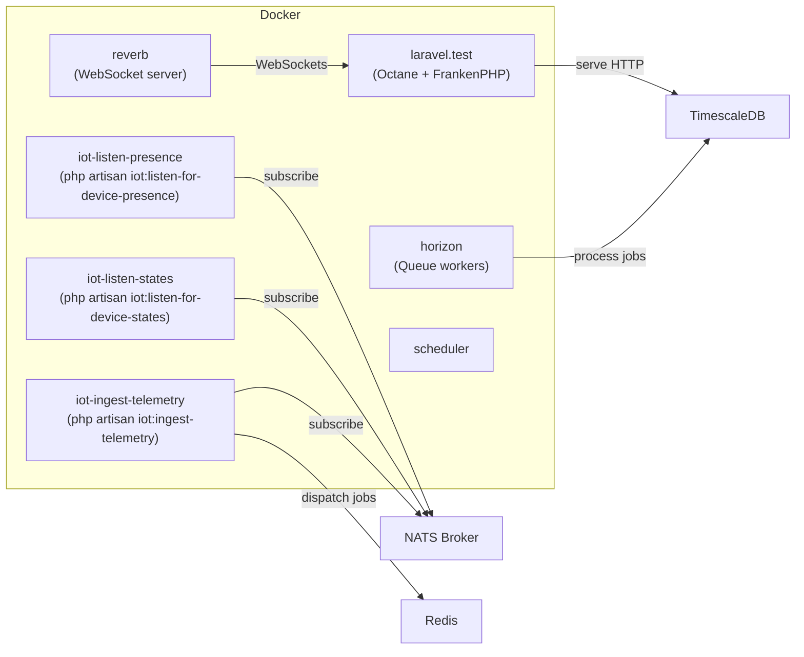
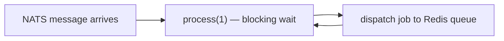
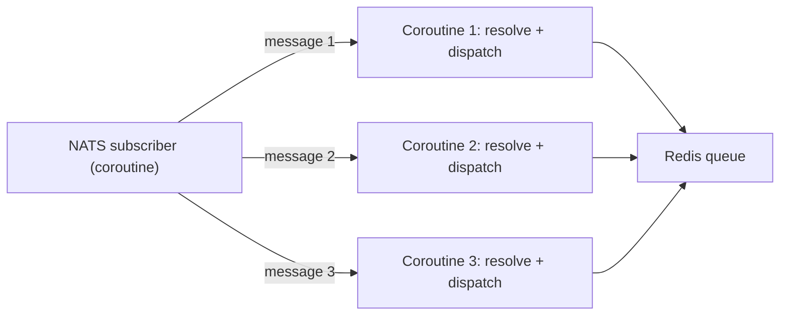
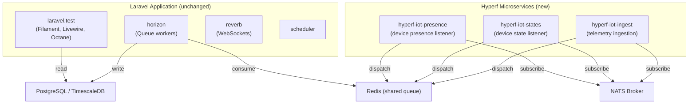
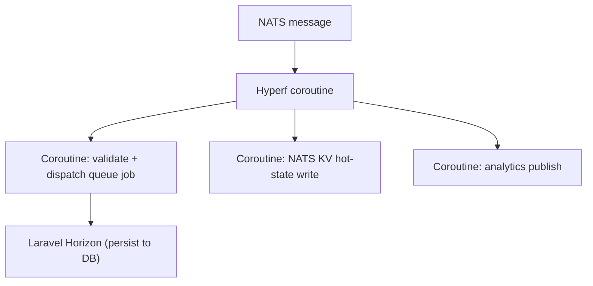

# Hyperf Framework Adoption Research

## Overview

This document evaluates how the [Hyperf framework](https://hyperf.io/) can be adopted for the LMU IoT Portal, identifies the components that benefit most from its coroutine-based concurrency model, and proposes a concrete hybrid adoption strategy.

---

## What Is Hyperf?

Hyperf is a high-performance PHP framework built on [Swoole](https://openswoole.com/) or Swow. Unlike traditional PHP frameworks that follow a process-per-request model (PHP-FPM), Hyperf keeps processes alive across many requests using coroutines, which allows non-blocking I/O with a fraction of the memory overhead.

| Capability | Description |
|---|---|
| Coroutine-based I/O | Non-blocking socket, NATS, Redis, and database operations within the same process |
| NATS client | Native coroutine-safe NATS pub/sub and JetStream support |
| Long-lived processes | Designed for persistent workers, not one-shot PHP-FPM scripts |
| Dependency injection | PSR-11 container with annotation-driven DI |
| Microservice-native | Built-in support for gRPC, service discovery, and distributed tracing |
| Command / process model | Artisan-style commands and persistent process supervisors |

---

## Current Architecture Summary

The IoT portal runs several long-lived PHP processes alongside the main Laravel web application.



The main Laravel app (`laravel.test`) is tightly coupled to Filament 5, Livewire 4, Eloquent, and the full Laravel ecosystem — this cannot be replaced by Hyperf without discarding the entire UI layer.

However, the three IoT listener services (`iot-ingest-telemetry`, `iot-listen-states`, `iot-listen-presence`) are long-running processes that only use a subset of Laravel: NATS connectivity, queue dispatch, and a handful of Eloquent queries. These are the best candidates for Hyperf adoption.

---

## Why Hyperf for IoT Listeners?

The current listener processes share two architectural limitations.

### 1. Blocking poll loop

The `iot:ingest-telemetry` command uses a blocking `while (true)` poll loop with a synchronous NATS client (`basis-company/nats`). A single process handles one message at a time. When message rates rise, the process falls behind and back-pressure builds on the NATS subject.



### 2. Single-threaded dispatch

Each listener process is a sequential PHP loop. To scale, the current approach requires running more Docker replicas, each with its full Laravel bootstrap overhead (~50–100 MB per process).

### Hyperf improvement

Hyperf uses coroutines, allowing a single process to handle multiple NATS messages concurrently without blocking.



This means:
- One Hyperf process replaces several Laravel replicas.
- Memory usage per concurrent message drops significantly.
- No blocking I/O delays message receipt while a job is being dispatched.

---

## Component Evaluation

| Service | Current stack | Hyperf candidate? | Reason |
|---|---|---|---|
| `laravel.test` (web + Filament) | Laravel 12 + Octane + FrankenPHP | ❌ No | Filament 5 and Livewire 4 are Laravel-only; replacing the web layer would require rewriting the entire admin UI |
| `horizon` (queue workers) | Laravel Horizon + Redis | ❌ No | Horizon provides queue management UI, retry policies, and supervisor controls; no direct Hyperf equivalent with the same observability |
| `reverb` (WebSocket) | Laravel Reverb | ❌ No | Reverb integrates directly with Laravel's broadcasting system and Filament dashboard |
| `iot-ingest-telemetry` | Laravel command (blocking poll loop) | ✅ Yes | Best candidate — no UI, minimal Laravel dependency, high throughput need |
| `iot-listen-states` | Laravel command (blocking poll loop) | ✅ Yes | Same pattern as ingestion; handles device state callbacks from NATS |
| `iot-listen-presence` | Laravel command (blocking poll loop) | ✅ Yes | Same pattern; handles device presence/online-offline transitions |
| `scheduler` | Laravel schedule:work | ❌ No | Scheduler drives cron-style tasks tied to Laravel command classes |

---

## Recommended Adoption Strategy: Hybrid Architecture

The cleanest path is a **hybrid architecture** that keeps Laravel for the web application and replaces only the IoT listener microservices with Hyperf.



### Key points

- The Hyperf services share the same Redis queue as the Laravel Horizon workers — no protocol translation is needed.
- Hyperf publishes a serialized queue job payload compatible with Laravel's queue system (the job class name + serialized data in the `payload` field of the Redis job structure).
- The Laravel application continues to own all persistence, validation, mutation, and derivation logic through Horizon workers.
- Hyperf only replaces the **ingress boundary**: subscribe to NATS, filter subjects, and dispatch a queue job.

---

## Integration Contract

### Queue payload compatibility

Laravel's Redis queue serializes jobs as JSON. Hyperf must produce an identical payload so Laravel Horizon can deserialize and process the job.

```json
{
  "displayName": "App\\Domain\\DataIngestion\\Jobs\\ProcessInboundTelemetryJob",
  "job": "Illuminate\\Queue\\CallQueuedHandler@call",
  "maxTries": null,
  "maxExceptions": null,
  "failOnTimeout": false,
  "backoff": null,
  "timeout": null,
  "retryUntil": null,
  "data": {
    "commandName": "App\\Domain\\DataIngestion\\Jobs\\ProcessInboundTelemetryJob",
    "command": "<serialized job>"
  }
}
```

The Hyperf ingestion service must serialize the `IncomingTelemetryEnvelope` array and push it onto the correct Redis list using the same key convention as Laravel Horizon (`queues:ingestion`).

### Shared configuration

Both services read from the same `.env` file. Environment variables required by the Hyperf services are a subset of the existing configuration:

| Variable | Used by | Description |
|---|---|---|
| `INGESTION_NATS_HOST` | Hyperf ingest | NATS broker host |
| `INGESTION_NATS_PORT` | Hyperf ingest | NATS broker port |
| `IOT_NATS_HOST` | Hyperf states/presence | NATS broker host |
| `IOT_NATS_PORT` | Hyperf states/presence | NATS broker port |
| `REDIS_HOST` | Hyperf ingest | Queue backend |
| `REDIS_PORT` | Hyperf ingest | Queue backend port |

---

## NATS Integration in Hyperf

Hyperf provides a coroutine-safe NATS client through the `hyperf/nats` component. A basic subscriber looks like this:

```php
use Hyperf\Nats\Client;

$client = make(Client::class);
$client->subscribe('devices.>', function (Message $message): void {
    $topic    = str_replace('.', '/', $message->subject);
    $envelope = IncomingTelemetryEnvelope::fromNatsMessage($topic, $message->body);

    // Push to Laravel Redis queue
    $this->queue->push(ProcessInboundTelemetryJob::class, $envelope->toArray());
});

$client->process();
```

Because this runs inside a coroutine, the `process()` loop yields to other coroutines while waiting for NATS messages — no blocking.

---

## Adoption Path

### Phase 1: Proof of concept (single service)

1. Create a new Hyperf project at `services/hyperf-iot-ingest`.
2. Implement a NATS subscriber that mirrors the logic in `IngestTelemetryCommand`.
3. Push queue jobs to the shared Redis queue using the Laravel-compatible payload format.
4. Add a `hyperf-iot-ingest` service to `compose.yaml` alongside the existing `iot-ingest-telemetry` service.
5. Run both in parallel and compare throughput and error rates.
6. Retire the Laravel command once the Hyperf service proves equivalent.

### Phase 2: Migrate state and presence listeners

Apply the same pattern to `iot-listen-states` and `iot-listen-presence`.

### Phase 3: Coroutine fan-out (optional)

Once Phase 1 is stable, evaluate whether the Hyperf service should handle the downstream side effects (hot-state write, analytics publish) directly using coroutine fan-out instead of going through a queue. This reduces overall latency but introduces more coupling in the ingest service.



This fan-out option trades simplicity for latency and should only be considered after Phase 1 is proven.

---

## Risk Assessment

| Risk | Severity | Mitigation |
|---|---|---|
| Laravel queue payload incompatibility | High | Validate payload format with Horizon before retiring the Laravel command |
| Hyperf NATS client maturity | Medium | Pin a stable Hyperf version; test against the same NATS 2.11 image used in compose.yaml |
| Operational unfamiliarity with Swoole/Hyperf | Medium | Keep the Laravel command as a fallback; run Hyperf behind a Pennant feature flag if possible |
| Subject filtering parity | Low | Port the subject ignore list (`$JS.`, `$KV.`, `_INBOX.`, `_REQS.`, analytics prefix) from the Laravel command |
| Database access from Hyperf | Low | Phase 1 avoids direct DB access; Hyperf services only push to the Redis queue |

---

## What Hyperf Does Not Replace

- **Filament admin panel** — the rich UI built on Filament 5 and Livewire 4 is Laravel-native and cannot run on Hyperf.
- **Laravel Horizon** — queue workers and the Horizon dashboard remain on Laravel.
- **Laravel Reverb** — WebSocket broadcasting to dashboards stays on Reverb.
- **Eloquent persistence pipeline** — all database writes continue in the Horizon workers.
- **Laravel Pennant feature flags** — feature gating remains in the Laravel application.

---

## Alternative: Hypervel (Laravel + Coroutines)

[Hypervel](https://hypervel.org/) is a community project that ports Laravel's API surface to run on top of Swoole coroutines. It offers a middle path: familiar Laravel syntax with Hyperf-level concurrency.

| | Hyperf | Hypervel | Laravel Octane (current) |
|---|---|---|---|
| Coroutines | ✅ Native | ✅ Ported | ✅ Via Swoole/FrankenPHP |
| Laravel ecosystem | ❌ | ✅ | ✅ |
| Filament compatibility | ❌ | ❓ Partial | ✅ |
| NATS coroutine client | ✅ | Depends on driver | ❌ Native |
| Production maturity | High | Low-medium | High |

Hypervel is not recommended as the primary path given its lower maturity, but it may be worth watching as an alternative that avoids a separate framework.

---

## Recommended Next Steps

1. Confirm the Redis queue payload format expected by the `ProcessInboundTelemetryJob` Horizon worker.
2. Build the `services/hyperf-iot-ingest` proof of concept (Phase 1 above).
3. Add the new service to `compose.yaml` and run it alongside the existing Laravel command.
4. Benchmark message throughput and latency at 1,000 msg/s to validate the improvement.
5. Document findings and decide whether to proceed with Phases 2 and 3.

---

## References

- Hyperf documentation: <https://hyperf.io/en/>
- Hyperf NATS component: <https://github.com/hyperf/nats>
- Hypervel: <https://hypervel.org/>
- Existing tech research: [05-technology-research.md](05-technology-research.md)
- Fleet scale remediation plan: [06-fleet-scale-remediation-plan.md](06-fleet-scale-remediation-plan.md)
